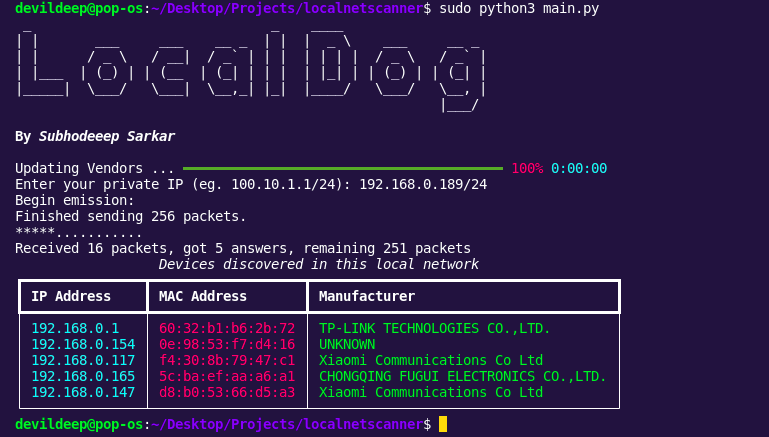

# LocalDog
***By Subhodeep Sarkar***
<hr>
This is a script that scans the local network using ARP packets and discovers the devices that are connected to the network, their local IP address, MAC address and corresponding manufacturer name.

### Dependencies
```
mac_vendor_lookup
scapy
rich
pyfiglet
```
### Usage
- Install all dependencies
  ```pip install -r requirements.txt```
- Run ```python main.py```
- Enter your current local IP to start the scan ```e.g 192.168.0.1/24```

### Demo

